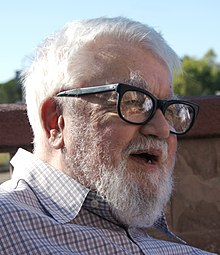

<table class="infobox biography vcard">
<tbody>
<tr>
<th colspan="2">

Professor

 

John McCarthy

 

Ph.D.

</th>
</tr>
<tr>
<td colspan="2">

John McCarthy at a conference in 2006

</td>
</tr>
<tr>
<th scope="row">Born</th>
<td>September 4, 1927 

<a class="mw-redirect" title="Boston, Massachusetts" href="https://en.wikipedia.org/wiki/Boston,_Massachusetts">Boston, Massachusetts</a>, U.S.

</td>
</tr>
<tr>
<th scope="row">Died</th>
<td>October 24, 2011&nbsp;(aged&nbsp;84) 

<a title="Stanford, California" href="https://en.wikipedia.org/wiki/Stanford,_California">Stanford, California</a>, U.S.

</td>
</tr>
<tr>
<th scope="row">Alma&nbsp;mater</th>
<td><a title="Princeton University" href="https://en.wikipedia.org/wiki/Princeton_University">Princeton University</a>,&nbsp;<a title="California Institute of Technology" href="https://en.wikipedia.org/wiki/California_Institute_of_Technology">California Institute of Technology</a></td>
</tr>
<tr>
<th scope="row">Known&nbsp;for</th>
<td><a title="Artificial intelligence" href="https://en.wikipedia.org/wiki/Artificial_intelligence">Artificial intelligence</a>,&nbsp;<a title="Lisp (programming language)" href="https://en.wikipedia.org/wiki/Lisp_(programming_language)">Lisp</a>,&nbsp;<a title="Circumscription (logic)" href="https://en.wikipedia.org/wiki/Circumscription_(logic)">circumscription</a>,&nbsp;<a title="Situation calculus" href="https://en.wikipedia.org/wiki/Situation_calculus">situation calculus</a></td>
</tr>
<tr>
<th scope="row">Awards</th>
<td><a title="Turing Award" href="https://en.wikipedia.org/wiki/Turing_Award">Turing Award</a>&nbsp;(1971) <a title="Computer Pioneer Award" href="https://en.wikipedia.org/wiki/Computer_Pioneer_Award">Computer Pioneer Award</a>&nbsp;(1985) <a title="IJCAI Award for Research Excellence" href="https://en.wikipedia.org/wiki/IJCAI_Award_for_Research_Excellence">IJCAI Award for Research Excellence</a>&nbsp;(1985) <a title="Kyoto Prize" href="https://en.wikipedia.org/wiki/Kyoto_Prize">Kyoto Prize</a>&nbsp;(1988) <a title="National Medal of Science" href="https://en.wikipedia.org/wiki/National_Medal_of_Science">National Medal of Science</a>&nbsp;(1990) <a class="mw-redirect" title="Benjamin Franklin Medal (Franklin Institute)" href="https://en.wikipedia.org/wiki/Benjamin_Franklin_Medal_(Franklin_Institute)">Benjamin Franklin Medal</a>&nbsp;(2003)</td>
</tr>
<tr>
<td colspan="2"><strong>Scientific career</strong></td>
</tr>
<tr>
<th scope="row">Fields</th>
<td class="category"><a title="Computer science" href="https://en.wikipedia.org/wiki/Computer_science">Computer science</a></td>
</tr>
<tr>
<th scope="row">Institutions</th>
<td><a title="Stanford University" href="https://en.wikipedia.org/wiki/Stanford_University">Stanford University</a>,&nbsp;<a title="Massachusetts Institute of Technology" href="https://en.wikipedia.org/wiki/Massachusetts_Institute_of_Technology">Massachusetts Institute of Technology</a>,&nbsp;<a title="Dartmouth College" href="https://en.wikipedia.org/wiki/Dartmouth_College">Dartmouth College</a>,&nbsp;<a title="Princeton University" href="https://en.wikipedia.org/wiki/Princeton_University">Princeton University</a></td>
</tr>
<tr>
<th scope="row"><a title="Doctoral advisor" href="https://en.wikipedia.org/wiki/Doctoral_advisor">Doctoral advisor</a></th>
<td><a title="Solomon Lefschetz" href="https://en.wikipedia.org/wiki/Solomon_Lefschetz">Solomon Lefschetz</a></td>
</tr>
<tr>
<th scope="row">Doctoral students</th>
<td><a title="Ruzena Bajcsy" href="https://en.wikipedia.org/wiki/Ruzena_Bajcsy">Ruzena Bajcsy</a> <a title="Ramanathan V. Guha" href="https://en.wikipedia.org/wiki/Ramanathan_V._Guha">Ramanathan V. Guha</a> <a title="Barbara Liskov" href="https://en.wikipedia.org/wiki/Barbara_Liskov">Barbara Liskov</a> <a title="Raj Reddy" href="https://en.wikipedia.org/wiki/Raj_Reddy">Raj Reddy</a></td>
</tr>
</tbody>
</table>

 

<strong>John McCarthy</strong>&nbsp;(September 4, 1927 &ndash; October 24, 2011) was an American&nbsp;<a title="Computer scientist" href="https://en.wikipedia.org/wiki/Computer_scientist">computer scientist</a>&nbsp;and&nbsp;<a class="mw-redirect" title="Cognitive scientist" href="https://en.wikipedia.org/wiki/Cognitive_scientist">cognitive scientist</a>. McCarthy was one of the founders of the discipline of&nbsp;<a title="Artificial intelligence" href="https://en.wikipedia.org/wiki/Artificial_intelligence">artificial intelligence</a>.&nbsp;He coined the term "<a title="Artificial intelligence" href="https://en.wikipedia.org/wiki/Artificial_intelligence">artificial intelligence</a>" (AI),&nbsp;developed the&nbsp;<a title="Lisp (programming language)" href="https://en.wikipedia.org/wiki/Lisp_(programming_language)">Lisp</a>&nbsp;<a title="Programming language" href="https://en.wikipedia.org/wiki/Programming_language">programming language</a>&nbsp;family, significantly influenced the design of the&nbsp;<a title="ALGOL" href="https://en.wikipedia.org/wiki/ALGOL">ALGOL</a>&nbsp;programming language, popularized&nbsp;<a title="Time-sharing" href="https://en.wikipedia.org/wiki/Time-sharing">time-sharing</a>, invented&nbsp;<a title="Garbage collection (computer science)" href="https://en.wikipedia.org/wiki/Garbage_collection_(computer_science)">garbage collection</a>, and was very influential in the early development of AI.

McCarthy spent most of his career at&nbsp;<a title="Stanford University" href="https://en.wikipedia.org/wiki/Stanford_University">Stanford University</a>.&nbsp;He received many accolades and honors, such as the 1971&nbsp;<a title="Turing Award" href="https://en.wikipedia.org/wiki/Turing_Award">Turing Award</a>&nbsp;for his contributions to the topic of AI,&nbsp;the United States&nbsp;<a title="National Medal of Science" href="https://en.wikipedia.org/wiki/National_Medal_of_Science">National Medal of Science</a>, and the&nbsp;<a title="Kyoto Prize" href="https://en.wikipedia.org/wiki/Kyoto_Prize">Kyoto Prize</a>.

 

<h2> Publications </h2>

<ul>
  
 <li><a target="_blank" href="https://github.com/manjunath5496/Papers-by-John-McCarthy/blob/master/jmc(1).pdf" style="text-decoration:none;">Artificial Intelligence, Logic and Formalizing Common Sense</a></li>
  
<li><a target="_blank" href="https://github.com/manjunath5496/Papers-by-John-McCarthy/blob/master/jmc(2).pdf" style="text-decoration:none;">The Common Business Communication Language </a></li>

<li><a target="_blank" href="https://github.com/manjunath5496/Papers-by-John-McCarthy/blob/master/jmc(3).pdf" style="text-decoration:none;">Defending AI Research</a></li>                         
  <li><a target="_blank" href="https://github.com/manjunath5496/Papers-by-John-McCarthy/blob/master/jmc(4).pdf" style="text-decoration:none;">Elephant 2000: A Programming Language Based on Speech Acts</a></li>
  
   <li><a target="_blank" href="https://github.com/manjunath5496/Papers-by-John-McCarthy/blob/master/jmc(5).pdf" style="text-decoration:none;">LISP &minus; notes on its past and future &minus; 1980</a></li>  
   
 <li><a target="_blank" href="https://github.com/manjunath5496/Papers-by-John-McCarthy/blob/master/jmc(6).pdf" style="text-decoration:none;">Programs with Common Sense</a></li>
  
<li><a target="_blank" href="https://github.com/manjunath5496/Papers-by-John-McCarthy/blob/master/jmc(7).pdf" style="text-decoration:none;"> Correctness of a Compiler for Arithmetic Expressions</a></li>

 <li><a target="_blank" href="https://github.com/manjunath5496/Papers-by-John-McCarthy/blob/master/jmc(8).pdf" style="text-decoration:none;">Networks Considered Harmful &minus; For Electronic Mail</a></li>
  
<li><a target="_blank" href="https://github.com/manjunath5496/Papers-by-John-McCarthy/blob/master/jmc(9).pdf" style="text-decoration:none;">Criteria for Usefulness of Computers in Offices </a></li>

<li><a target="_blank" href="https://github.com/manjunath5496/Papers-by-John-McCarthy/blob/master/jmc(10).pdf" style="text-decoration:none;">Recursive Functions of Symbolic Expressions and Their Computation by Machine, Part I</a></li>                         
  <li><a target="_blank" href="https://github.com/manjunath5496/Papers-by-John-McCarthy/blob/master/jmc(11).pdf" style="text-decoration:none;">Towards a Mathematical Science of Computation</a></li>
  
   <li><a target="_blank" href="https://github.com/manjunath5496/Papers-by-John-McCarthy/blob/master/jmc(12).pdf" style="text-decoration:none;">Concepts of Logical AI</a></li>  
   

 </ul>
